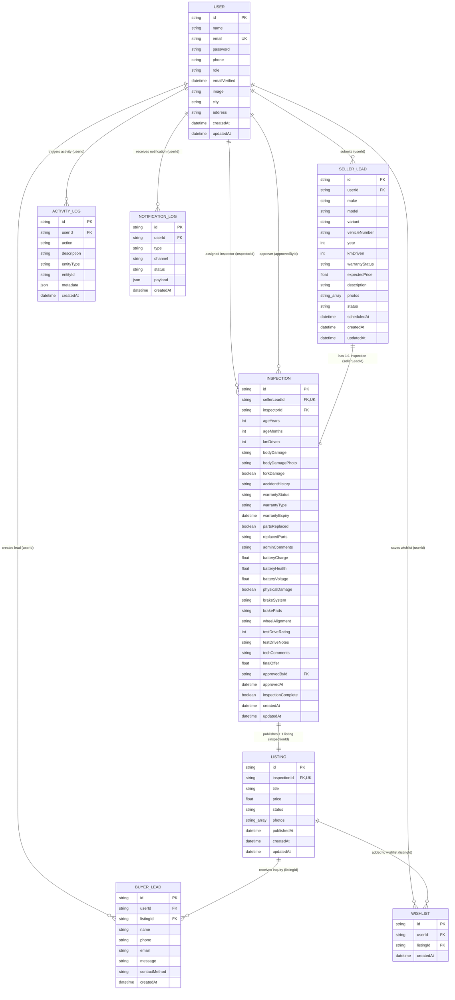
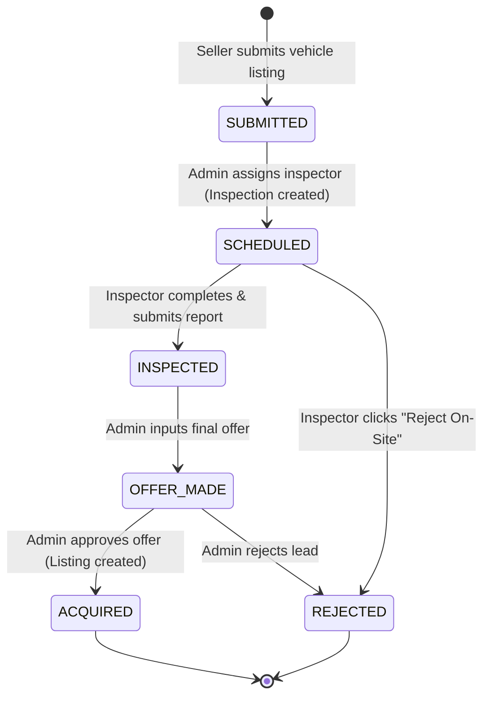
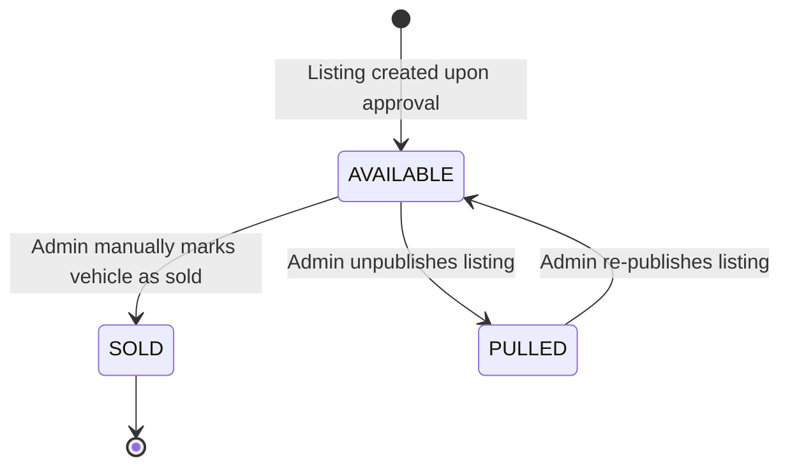

# Veltrik — Complete Entity-Relationship (ER) Diagram & Architecture Specification

Veltrik is a C2B used electric vehicle (EV) marketplace. Below is the complete, production-accurate ER diagram, complete entity definitions, relationship specifications, state machine flows, and notification triggers.

---

## 1. Entity Definitions

### User
| Field | Type | Constraint |
|---|---|---|
| **id** | string | PK, CUID |
| **name** | string | NOT NULL |
| **email** | string | UNIQUE, NOT NULL |
| **password** | string | NOT NULL |
| **phone** | string | Nullable |
| **role** | enum | NOT NULL, default `BUYER` (`BUYER`, `SELLER`, `INSPECTOR`, `ADMIN`, `MANAGER`) |
| **emailVerified** | datetime | Nullable |
| **image** | string | Nullable |
| **city** | string | Nullable |
| **address** | string | Nullable |
| **createdAt** | datetime | NOT NULL |
| **updatedAt** | datetime | NOT NULL |

---

### SellerLead
| Field | Type | Constraint |
|---|---|---|
| **id** | string | PK, CUID |
| **userId** | string | FK → `User.id`, NOT NULL |
| **make** | string | NOT NULL |
| **model** | string | NOT NULL |
| **variant** | string | NOT NULL |
| **vehicleNumber** | string | NOT NULL |
| **year** | integer | NOT NULL |
| **kmDriven** | integer | NOT NULL |
| **warrantyStatus** | string | NOT NULL |
| **expectedPrice** | float | NOT NULL |
| **description** | string | Nullable |
| **photos** | string[] | NOT NULL (JSON stringified array) |
| **status** | enum | default `SUBMITTED` (`SUBMITTED`, `SCHEDULED`, `INSPECTED`, `OFFER_MADE`, `ACQUIRED`, `REJECTED`) |
| **scheduledAt** | datetime | Nullable |
| **createdAt** | datetime | NOT NULL |
| **updatedAt** | datetime | NOT NULL |

> [!NOTE]
> `inspectorId` is deliberately excluded from `SellerLead`. Inspectors are assigned exclusively through the `Inspection` record.

---

### Inspection
| Field | Type | Constraint |
|---|---|---|
| **id** | string | PK, CUID |
| **sellerLeadId** | string | FK → `SellerLead.id`, UNIQUE (1:1) |
| **inspectorId** | string | FK → `User.id`, NOT NULL |
| **ageYears** | integer | Nullable |
| **ageMonths** | integer | Nullable |
| **kmDriven** | integer | Nullable |
| **bodyDamage** | string | Nullable |
| **bodyDamagePhoto** | string | Nullable |
| **forkDamage** | boolean | Nullable |
| **accidentHistory** | string | Nullable |
| **warrantyStatus** | string | Nullable |
| **warrantyType** | string | Nullable |
| **warrantyExpiry** | datetime | Nullable |
| **partsReplaced** | boolean | Nullable |
| **replacedParts** | string[] | Nullable |
| **adminComments** | string | Nullable |
| **batteryCharge** | float | Nullable |
| **batteryHealth** | float | Nullable |
| **batteryVoltage** | float | Nullable |
| **physicalDamage** | boolean | Nullable |
| **brakeSystem** | string | Nullable |
| **brakePads** | string | Nullable |
| **wheelAlignment** | string | Nullable |
| **testDriveRating** | integer | Nullable |
| **testDriveNotes** | string | Nullable |
| **techComments** | string | Nullable |
| **finalOffer** | float | Nullable |
| **approvedById** | string | FK → `User.id`, Nullable |
| **approvedAt** | datetime | Nullable |
| **inspectionComplete** | boolean | default `false` |
| **createdAt** | datetime | NOT NULL |
| **updatedAt** | datetime | NOT NULL |

---

### Listing
| Field | Type | Constraint |
|---|---|---|
| **id** | string | PK, CUID |
| **inspectionId** | string | FK → `Inspection.id`, UNIQUE (1:1) |
| **title** | string | NOT NULL |
| **price** | float | NOT NULL |
| **status** | enum | default `AVAILABLE` (`AVAILABLE`, `PULLED`, `SOLD`) |
| **photos** | string[] | NOT NULL, independently editable by admin |
| **publishedAt** | datetime | Nullable |
| **createdAt** | datetime | NOT NULL |
| **updatedAt** | datetime | NOT NULL |

---

### BuyerLead
| Field | Type | Constraint |
|---|---|---|
| **id** | string | PK, CUID |
| **userId** | string | FK → `User.id`, Nullable |
| **listingId** | string | FK → `Listing.id`, Nullable |
| **name** | string | NOT NULL |
| **phone** | string | NOT NULL |
| **email** | string | Nullable |
| **message** | string | Nullable |
| **contactMethod** | enum | NOT NULL (`WHATSAPP`, `PHONE`, `FORM`) |
| **createdAt** | datetime | NOT NULL |

> [!IMPORTANT]
> Composite unique constraint: `(phone, listingId)` to prevent duplicate buyer inquiries per listing.

---

### Wishlist
| Field | Type | Constraint |
|---|---|---|
| **id** | string | PK, CUID |
| **userId** | string | FK → `User.id`, NOT NULL |
| **listingId** | string | FK → `Listing.id`, NOT NULL |
| **createdAt** | datetime | NOT NULL |

> [!IMPORTANT]
> Composite unique constraint: `(userId, listingId)`

---

### ActivityLog
| Field | Type | Constraint |
|---|---|---|
| **id** | string | PK, CUID |
| **userId** | string | FK → `User.id`, NOT NULL |
| **action** | string | NOT NULL |
| **description** | string | NOT NULL |
| **entityType** | string | NOT NULL (e.g., `SellerLead`, `Listing`, `Inspection`) |
| **entityId** | string | NOT NULL |
| **metadata** | json | Nullable |
| **createdAt** | datetime | NOT NULL |

---

### NotificationLog
| Field | Type | Constraint |
|---|---|---|
| **id** | string | PK, CUID |
| **userId** | string | FK → `User.id`, NOT NULL |
| **type** | string | NOT NULL (e.g., `INSPECTION_ASSIGNED`, `INSPECTION_COMPLETED`, `OFFER_MADE`) |
| **channel** | enum | NOT NULL (`EMAIL`, `SMS`, `IN_APP`) |
| **status** | enum | NOT NULL (`SENT`, `FAILED`) |
| **payload** | json | Nullable |
| **createdAt** | datetime | NOT NULL |

---

## 2. Mermaid Entity-Relationship Diagram

---

## 3. Status State Machines

### SellerLead Status State Machine

### Listing Status State Machine

---

## 4. Notification Trigger Map

| Trigger Event | Target Recipient | Channels | Data Included |
|---|---|---|---|
| **Inspection Assigned** (Admin assigns inspector to `SellerLead`) | Assigned Inspector | `EMAIL` + `IN_APP` | Vehicle make, model, variant, vehicleNumber, year, kmDriven, seller name, seller phone |
| **Inspection Completed** (Inspector submits report with `inspectionComplete = true`) | Admin / Managers | `IN_APP` | `SellerLead.id`, vehicle title, inspector name |
| **Listing Approved** (Admin approves & transitions `SellerLead` → `ACQUIRED`) | Seller | `EMAIL` + `IN_APP` | Vehicle title, final offer price, public listing link |
| **Lead Rejected** (Admin or Inspector sets status → `REJECTED`) | Seller | `EMAIL` + `IN_APP` | Vehicle title, rejection reason / comments |

---

## 5. Explicit Exclusions Verification

The following entities and fields are **strictly excluded** from the database architecture:
- ❌ **`Booking` table**: Removed (No slot booking system).
- ❌ **`Payment` table**: Removed (No payment gateway integration).
- ❌ **`Conversation` & `Message` tables**: Removed (No in-app messaging system).
- ❌ **`SellerLead.inspectorId`**: Excluded from `SellerLead` (Inspectors are linked solely via `Inspection.inspectorId`).
